**Sistema de Recomendación de Carreras Universitarias Basado en el Perfil del Usuario – Tacna **

**Estudiantes:** 

**Cespedes Medina, Christian Alexander** **CCalli Chata, Joel Robert** 

**Antecedentes** 

El sistema de recomendación de carreras universitarias surge ante la dificultad que enfrentan muchos jóvenes al momento de elegir una carrera profesional acorde a sus intereses, habilidades y aspiraciones. La falta de orientación vocacional personalizada y el desconocimiento de las opciones disponibles generan decisiones mal informadas, deserción universitaria y baja satisfacción profesional. Este proyecto busca facilitar el proceso de elección vocacional mediante un sistema inteligente y automatizado que sugiera carreras afines al perfil del usuario. 

**Planteamiento del Problema** 

**Problema** 

Los estudiantes que culminan la educación secundaria suelen tener dificultades para identificar una carrera universitaria adecuada a su perfil personal, académico y vocacional. La carencia de herramientas tecnológicas de apoyo genera incertidumbre, desinformación y, en muchos casos, decisiones erróneas que afectan su futuro profesional. 

**Justificación** 

La implementación de un sistema de recomendación permitirá guiar a los jóvenes hacia decisiones más acertadas sobre su formación universitaria, considerando sus intereses, competencias y personalidad. Esto contribuirá a reducir los índices de deserción universitaria, aumentar la satisfacción vocacional y fomentar un mejor aprovechamiento del talento humano. 

**Alcance** 

El sistema abarcará el análisis del perfil del usuario a través de un cuestionario estructurado, procesamiento de respuestas mediante algoritmos de recomendación, visualización de resultados personalizados y sugerencia de carreras afines. También incluirá la posibilidad de generar reportes en PDF con los resultados obtenidos y permitirá el registro de usuarios para seguimiento. No incluirá asesoría en tiempo real ni integración con bases de datos externas de universidades en esta primera fase. 

**Objetivos** 

**Objetivo General** 

Desarrollar un sistema de recomendación de carreras universitarias que oriente a los usuarios en función de su perfil, intereses y aptitudes. 

**Objetivos Específicos** 

- Implementar un módulo de evaluación de intereses y habilidades del usuario. 
- Desarrollar un algoritmo de recomendación de carreras basado en el perfil individual. 
- Diseñar una interfaz amigable para la presentación de sugerencias personalizadas. 
- Permitir la generación de reportes PDF con los resultados de recomendación. 
- Facilitar el registro y autenticación de usuarios para mantener su historial. 

**Marco Teórico** 

- Fundamentos de orientación vocacional y teoría de las inteligencias múltiples. 
- Sistemas de recomendación: tipos y aplicaciones en la educación. 
- Arquitectura de software educativo basado en la web. 
- Técnicas de minería de datos y análisis de perfiles. 
- Seguridad de la información y privacidad de datos personales en entornos educativos. 

**Desarrollo de la Solución Análisis de Factibilidad** 

- **Evaluación técnica:** Uso de tecnologías modernas como ASP.NET y SQL Server, compatibles con aplicaciones web educativas. 
- **Evaluación económica:** Desarrollo con herramientas de código abierto y hosting económico en la nube (como somee.com). 
- **Evaluación operativa:** Mejora en el proceso de orientación vocacional y toma de decisiones educativas. 
- **Evaluación social:** Apoyo a jóvenes en su desarrollo profesional, contribuyendo al desarrollo educativo del país. 
- **Evaluación legal:** Cumplimiento de normativas de protección de datos personales de los usuarios. 
- **Evaluación ambiental:** Uso eficiente de recursos digitales, evitando material impreso innecesario. 

**Tecnología de Desarrollo** 

- **Lenguajes de programación:** ASP.NET con C# para el backend, HTML/CSS y JavaScript para el frontend. 
- **Base de datos:** SQL Server para almacenamiento de perfiles, resultados y configuraciones del sistema. 
- **Infraestructura:** Despliegue en la nube para asegurar disponibilidad, escalabilidad y accesibilidad remota. 

**Metodología de Implementación ![ref1]**

Se empleará la metodología ágil **Scrum**, que permitirá el desarrollo iterativo e incremental del sistema, facilitando la incorporación de mejoras continuas. Se elaborarán los siguientes documentos técnicos como base de planificación y ejecución: 

- Documento de Visión 
- Documento de Requisitos del Software (SRS) 
- Documento de Arquitectura del Sistema (SAD) 

Diagrama de Despliegue: 

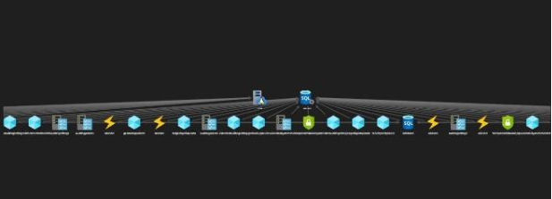

Infracost Report: 

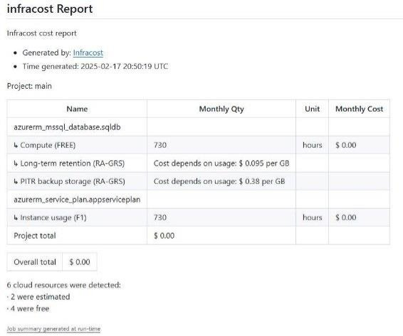

Diagrama de Arquitectura: ![ref1]

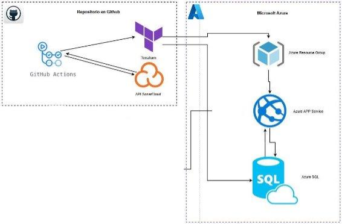

Diagrama del Proceso Propuesto 

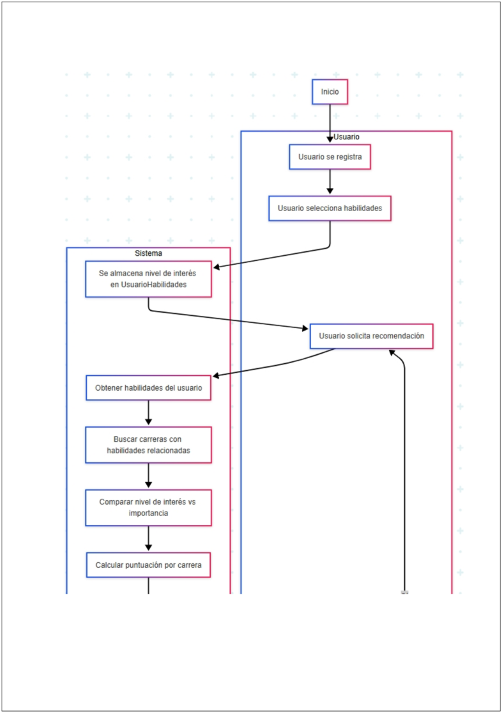

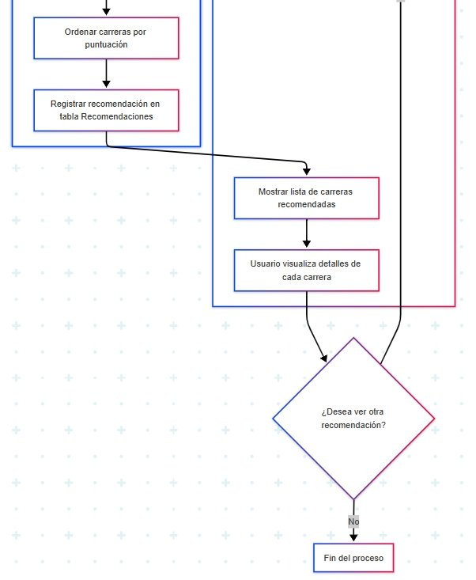

**II. Especificación de Requerimientos de Software ![ref1]**

Requerimientos Funcionales: 

|**Código** |**Nombre** |**Descripción** |**Prioridad** |
| - | - | - | - |
|RF-001 |Registro de Usuario |El sistema permitirá registrar nuevos usuarios con sus datos básicos para crear un perfil. |Alta |

|RF-002 |Inicio de Sesión |El sistema permitirá que los usuarios inicien sesión con su correo electrónico y contraseña. |Alta |
| - | - | :- | - |
|RF-003 |Ingreso de Perfil del Usuario |El sistema permitirá ingresar habilidades, intereses, rendimiento y tipo de personalidad. |Alta |
|RF-004 |Generar Recomendación |El sistema generará recomendaciones de carreras según los datos del perfil del usuario. |Alta |
|RF-005 |Visualizar Detalles de Carreras |El sistema mostrará detalles relevantes sobre cada carrera sugerida (duración, materias, etc.). |Alta |
|RF-006 |Guardar Recomendaciones |El usuario podrá guardar sus recomendaciones para visualizarlas posteriormente. |Media |
|RF-007 |Comparación de Carreras |El usuario podrá comparar dos o más carreras recomendadas por área, duración y dificultad. |Media |
|RF-008 |Filtros Avanzados |El sistema permitirá filtrar recomendaciones por ubicación, tipo de universidad o modalidad. |Media |
|RF-009 |Retroalimentación de Resultados |El sistema permitirá valorar la recomendación recibida para mejorar futuras sugerencias. |Baja |
|RF-010 |Test de Orientación Vocacional |El sistema incluirá un test vocacional basado en preguntas psicométricas para enriquecer el perfil. |Alta |

Requerimientos No Funcionales: ![ref1]

|**Código** |**Nombre** |**Descripción** |
| - | - | - |
|RNF- 001 |Seguridad |El sistema protegerá la información del usuario mediante protocolos HTTPS y cifrado de datos. |
|RNF- 002 |Rendimiento |Las recomendaciones se generarán en menos de 2 segundos bajo condiciones normales de carga. |
|RNF- 003 |Usabilidad |La interfaz será simple, intuitiva y amigable para usuarios sin experiencia técnica. |
|RNF- 004 |Accesibilidad |El sistema será accesible para usuarios con discapacidades, cumpliendo con estándares WCAG. |
|RNF- 005 |Mantenibilidad |El sistema estará desarrollado de forma modular para permitir mejoras y correcciones rápidas. |

**V. Fase de Desarrollo** 

**5.1. Perfiles de UsuarioGeneralización de Redes** 

|**Campo** |**Valor** |
| - | - |
|**Representante** |Administrador |
|**Descripción** |Responsable de la administración y gestión completa del sistema de recomendación de carreras, asegurando su funcionamiento y accesibilidad. |
|**Tipo** |Usuario con permisos totales sobre la gestión del sistema y asignación de privilegios a otros usuarios. |
|**Responsabilidades** |- Control total sobre la operación del sistema, sin restricciones. - Acceso y gestión a la base de datos de usuarios, recomendaciones y carreras. - Asignación de privilegios a otros usuarios (por ejemplo, asesores o estudiantes). - Monitoreo y supervisión de las recomendaciones generadas por el sistema. - Generación de reportes de uso del sistema y evidencia de recomendaciones realizadas. |

**HU01: Registro de Cliente** 

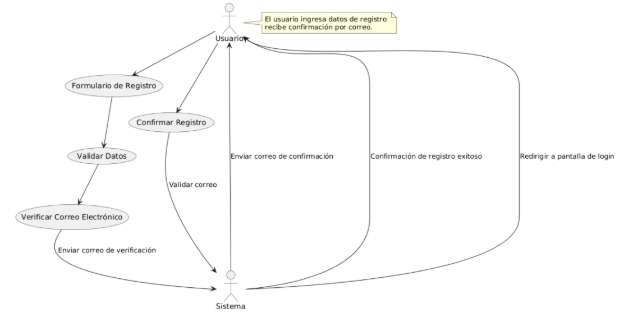

**HU02: Iniciar Sesión** 

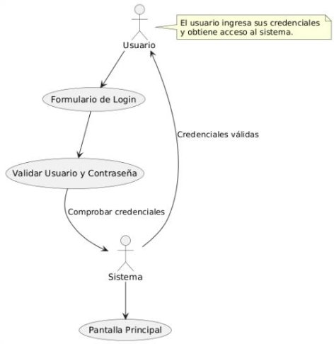

**HU03: Actualización de Perfil** 

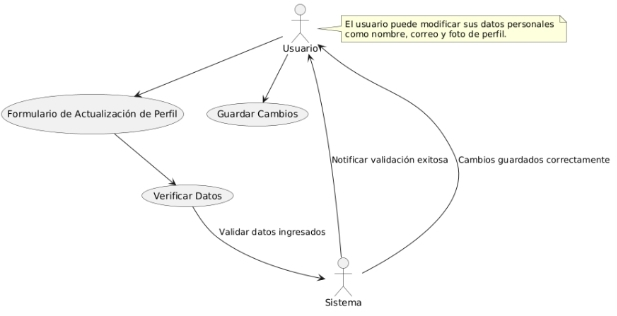

**HU04: Selección de Carrera** 

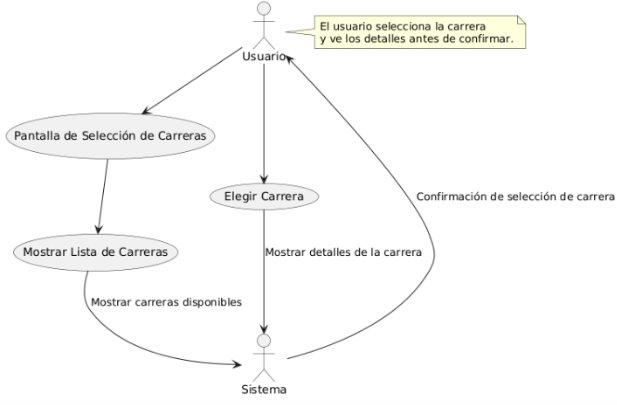

**HU05: Visualización de Recomendaciones** 

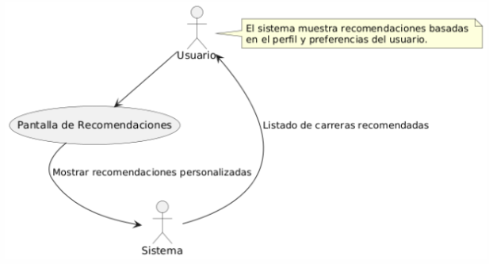

**HU06: Realizar Búsqueda de Carreras** 

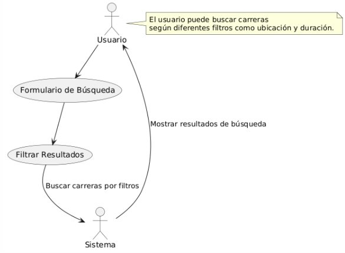

**HU07: Ver Detalles de una Carrera** 

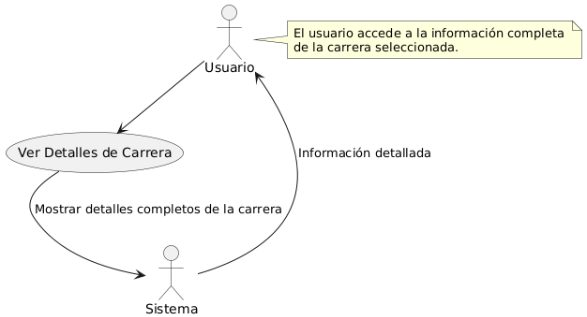

**HU08: Guardar Carreras Favoritas** 

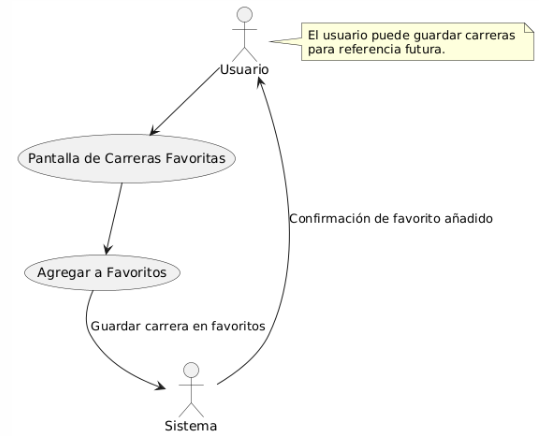

**HU09: Ver Histórico de Carreras Consultadas** 

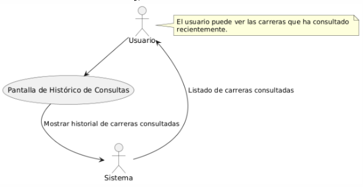

**HU10: Filtrar Carreras por Requisitos** 

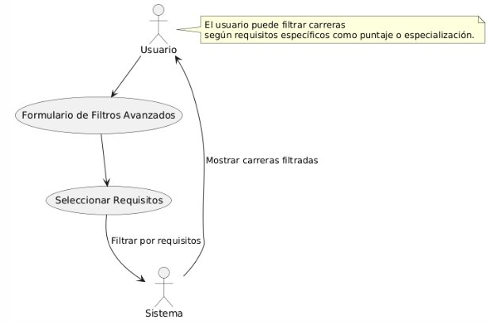

**HU11: Recomendar Carreras Basadas en Perfil** 

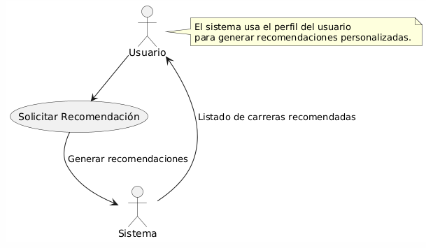

**HU12: Contactar con Asesor de Carreras** 

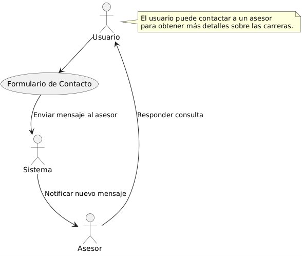

**HU13: Ver Notificaciones** 

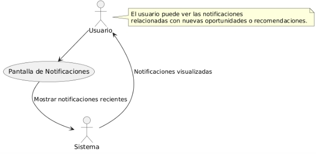

**HU14: Eliminar Carrera de Favoritos** 

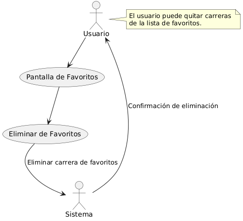

**HU15: Ver Detalles del Asesor** 

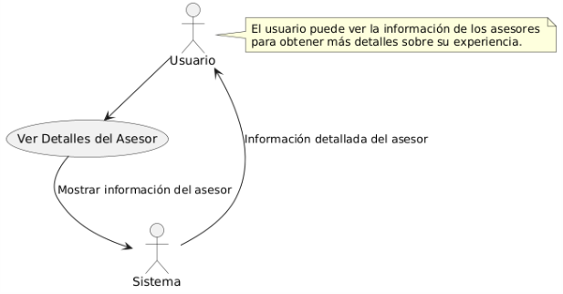

**HU16: Configurar Preferencias de Carreras** 

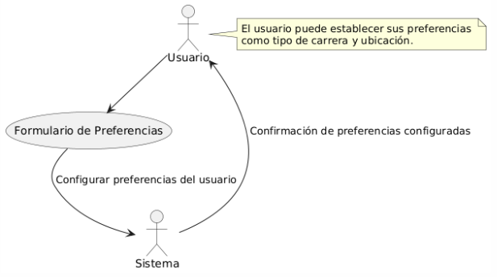

**HU17: Buscar Asesores por Especialidad** 

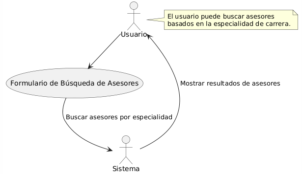

**HU18: Consultar Plan de Estudio de Carrera** 

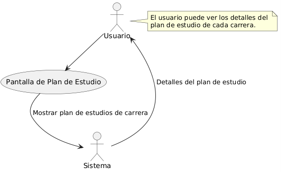

**HU19: Enviar Comentarios sobre el Sistema** 

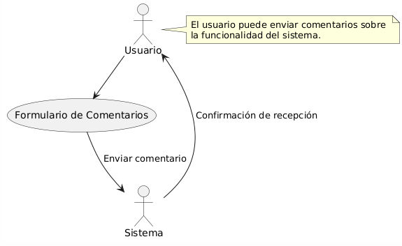

**HU20: Cerrar Sesión** 

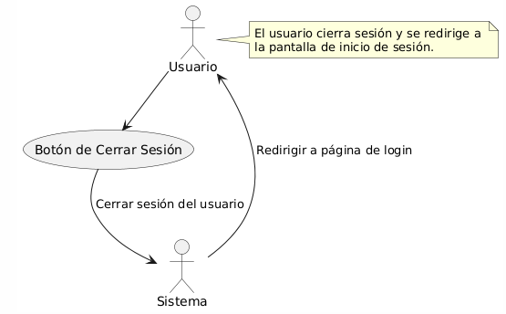

**Diagrama de Secuencia:** 

🔹 **HU01 - Registro de Cliente** 

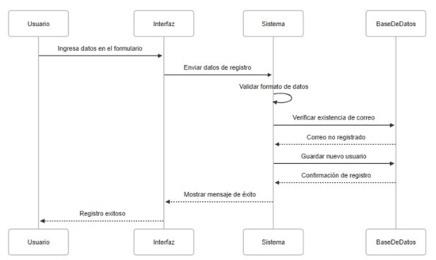

🔹 **HU02 - Iniciar Sesión** 

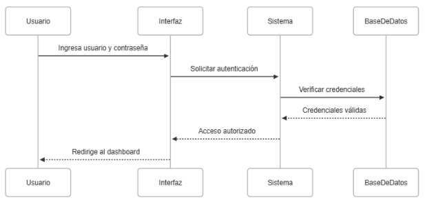

🔹 **HU03 - Actualización de Perfil** 

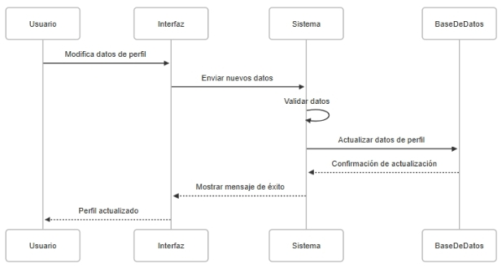

🔹 **HU04 - Selección de Carrera** 

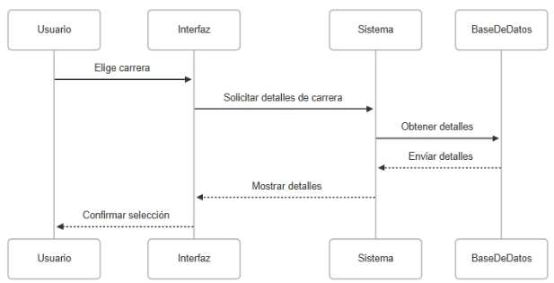

🔹 **HU05 - Visualización de Recomendaciones** 

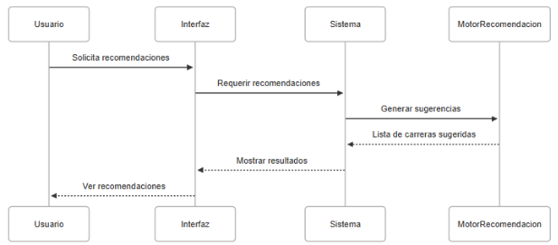

🔹 **HU06 - Realizar Búsqueda de Carreras** 

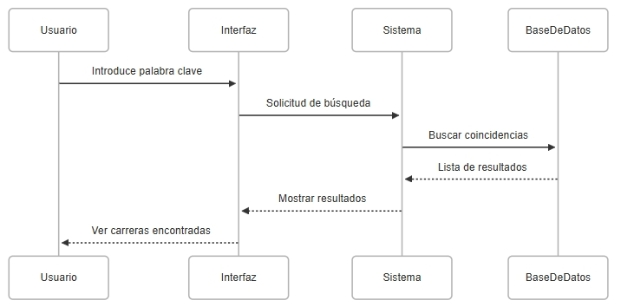

🔹 **HU07 - Ver Detalles de una Carrera** 

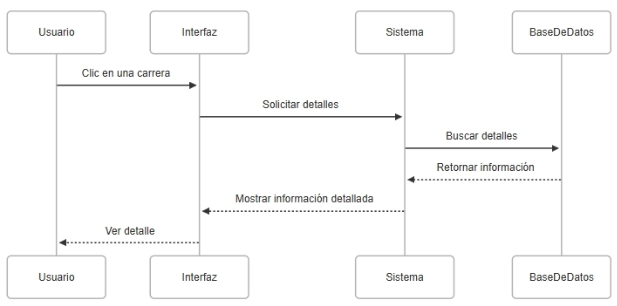

🔹 **HU08 - Guardar Carreras Favoritas** 

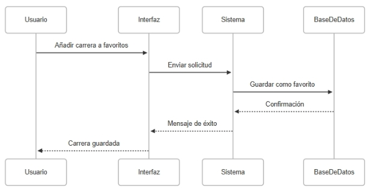

🔹 **HU09 - Ver Histórico de Carreras Consultadas** 

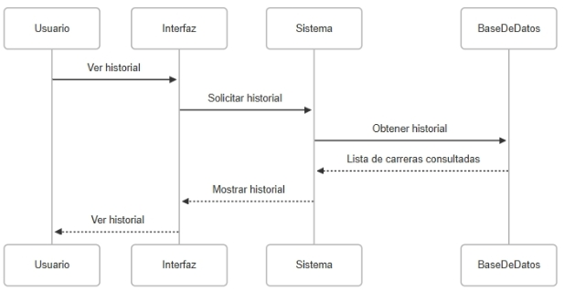

🔹 **HU10 - Filtrar Carreras por Requisitos** 

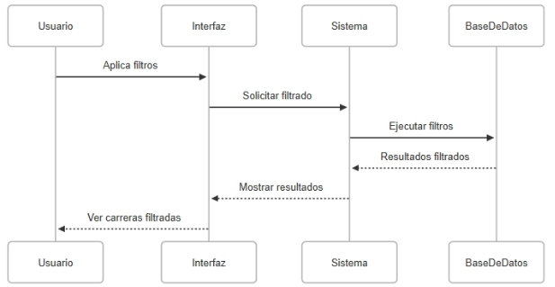

🔹 **HU11 - Comparar Carreras** 

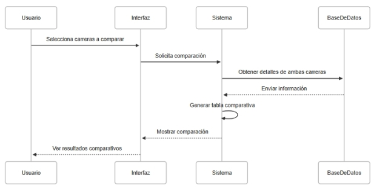

🔹 **HU12 - Evaluar Perfil del Usuario** 

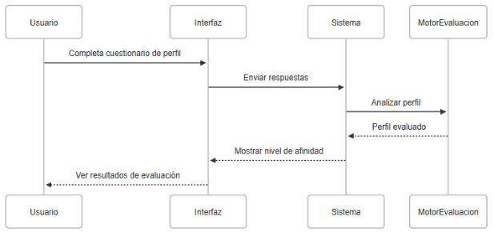

🔹 **HU13 - Recibir Recomendaciones por Correo** 

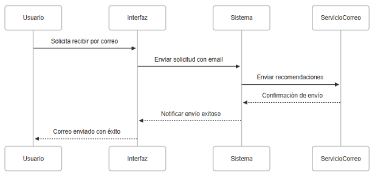

🔹 **HU14 - Acceder desde Dispositivo Móvil** 

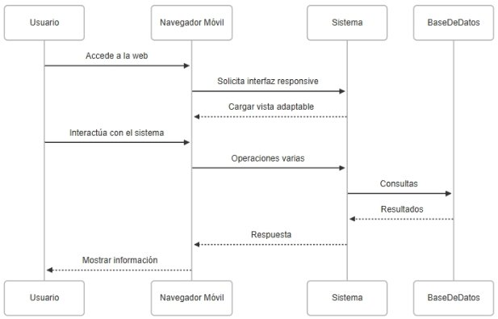

🔹 **HU15 - Recibir Notificaciones sobre Carreras** 

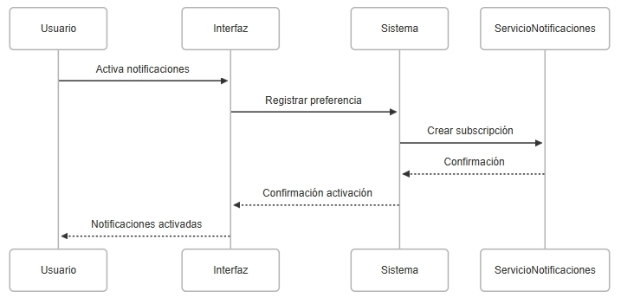

🔹 **HU16 - Descargar PDF de Recomendaciones** 

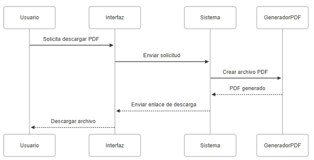

🔹 **HU17 - Calificar Carreras Recomendadas** 

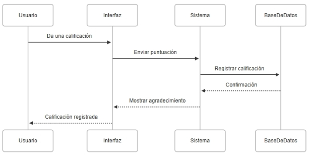

🔹 **HU18 - Contactar con un Asesor** 

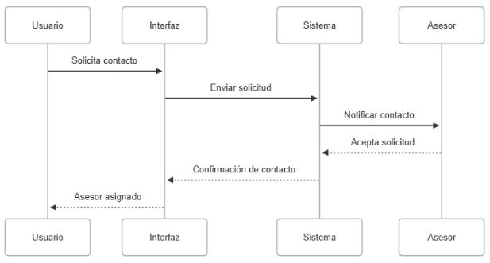

🔹 **HU19 - Visualizar Ranking de Carreras** 

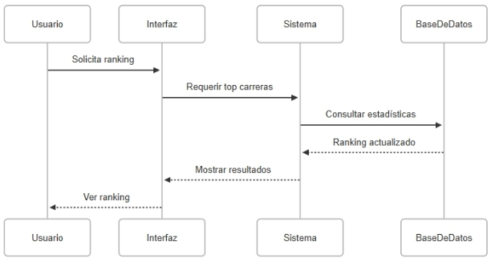

🔹 **HU20 - Gestionar Preferencias del Sistema** 

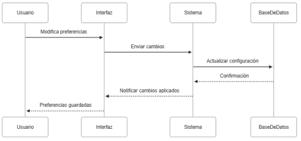

**Diagrama de Clases:** 

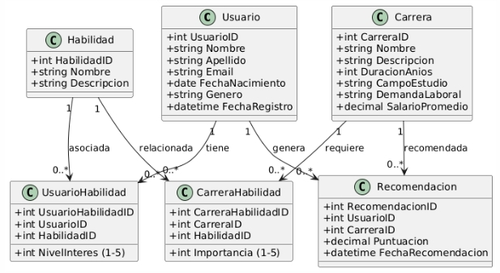

**Diagrama de Base de Datos:** 

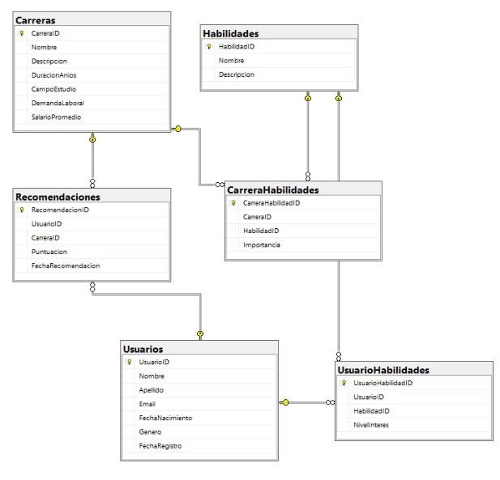

**Tablas de Base de Datos:** 

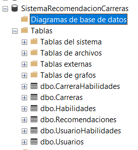

**Conclusión:** 

- El sistema propuesto de recomendación de carreras universitarias basado en el perfil del usuario proporcionará a los estudiantes una herramienta eficiente para tomar decisiones informadas sobre su futuro académico. Al ofrecer recomendaciones personalizadas según los intereses, habilidades y preferencias del usuario, el sistema facilita una experiencia única y personalizada, ayudando a los estudiantes a identificar las carreras más alineadas con sus objetivos profesionales. 

**Bibliografía:** 

1. García, M. (2020). *Sistemas de recomendación para educación superior*. Editorial Universitaria. 
1. Pérez, A., & Rodríguez, C. (2019). *Tecnologías de información aplicadas a la educación universitaria*. McGraw-Hill. 
1. López, J. (2021). *Análisis de datos y personalización de servicios educativos*. Editorial Académica. 
1. Sánchez, R., & Gómez, S. (2018). *Sistemas de recomendación: teoría y aplicaciones*. Springer. 
1. Hernández, P. (2022). *Inteligencia artificial en la educación: una aproximación práctica*. Pearson. 
1. Martínez, L., & Ruiz, V. (2020). *Innovaciones en sistemas de recomendación: Casos de estudio*. Elsevier. 
1. Castillo, F. (2021). *Evaluación de perfiles académicos para la recomendación de carreras*. Editorial Técnica. 
1. Fernández, M. (2019). *Algoritmos de recomendación y su impacto en la toma de decisiones*. Universidad de Barcelona. 
1. Pérez, L., & Jiménez, E. (2021). *Uso de big data en la educación: tendencias y perspectivas*. Wiley. 
1. Torres, A., & Ramírez, D. (2020). *Sistemas inteligentes para la personalización educativa en línea*. Routledge. 

[ref1]: img/Aspose.Words.83f84fd3-bf8f-47f0-8f7a-86f5438ab446.003.png
